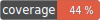

PHP SDK for "The Open Network" blockchain
---



[](https://packagist.org/packages/olifanton/ton)
[](https://packagist.org/packages/olifanton/ton)

## Prerequisites

- Minimum PHP 8.1;
- `ext-hash`;
- `ext-sodium` required as default cryptographic implementation;
- any httplug-compatible HTTP client (`php-http/client-common`), see [Documentation](https://docs.php-http.org/en/latest/clients.html);
- `ext-bcmath` not required, but strongly recommended for performance reasons.

## Installation

```bash
composer require olifanton/ton
```

## Examples

See [`examples`](./examples) directory.

### Running examples

1. Clone repository and install with development dependencies;
2. Get own testnet API key for Toncenter from [Telegram bot](https://t.me/tontestnetapibot);
3. Copy `.env.dist` to `.env`;
4. Put API key and seed phrase variables to `.env` file;
5. Run examples in console.

## Documentation

### Toncenter transport initialization

To use the SDK via Toncenter API, an HTTP client implementation is required. For the example, Guzzle will be used. If you are using another HTTP client supplied by your framework, refer to your framework's documentation and the [`httplug` documentation](https://docs.php-http.org/en/latest/index.html) for additional information.

1. Install http components via Composer:
```bash
composer require guzzlehttp/guzzle http-interop/http-factory-guzzle php-http/guzzle7-adapter
```

2. Setup Toncenter transport:
```php
<?php

use Http\Client\Common\HttpMethodsClient;
use Http\Discovery\HttpClientDiscovery;
use Http\Discovery\Psr17FactoryDiscovery;
use Olifanton\Ton\Transports\Toncenter\ToncenterHttpV2Client;
use Olifanton\Ton\Transports\Toncenter\ClientOptions;
use Olifanton\Ton\Transports\Toncenter\ToncenterTransport;

$isMainnet = false;
$toncenterApiKey = "..."; // Request API key from https://t.me/tontestnetapibot or https://t.me/tonapibot

// HTTP client initialization
$httpClient = new HttpMethodsClient(
    HttpClientDiscovery::find(),
    Psr17FactoryDiscovery::findRequestFactory(),
    Psr17FactoryDiscovery::findStreamFactory(),
);

// Toncenter API client initialization
$toncenter = new ToncenterHttpV2Client(
    $httpClient,
    new ClientOptions(
        $isMainnet ? "https://toncenter.com/api/v2" : "https://testnet.toncenter.com/api/v2",
        $toncenterApiKey,
    ),
);

// Transport initialization
$toncenterTransport = new ToncenterTransport($toncenter);

// ...

// Now you can use Toncenter transport as access point to blockchain
$toncenterTransport->send($someBoc);
```
See [`examples/common.php`](./examples/common.php) for complex Toncenter example.

### SDK components

_@WIP_

### Framework integration

_@WIP_

## Tests

```bash
composer run test:unit
```

# License

MIT
